# ACT部署到华为昇腾310B

## 前置条件

- Orange Pi AIpro(20T)开发板
- Windows电脑
- USB数据线

## 准备工作

### 第一步：下载balenaEtcher软件

进入[balenaEtcher官网](https://etcher.balena.io/ "balenaEtcher")

将会看到以下界面，点击红框所示的**Download Etcher**按钮

随即会跳转到以下界面，点击红框内的**Download**

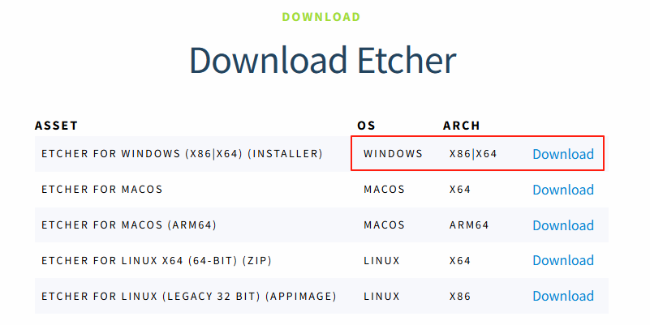

### 第二步：下载orange pi的ubuntu官方镜像

使用百度云盘下载**orange pi的ubuntu官方镜像**

链接：https://pan.baidu.com/share/init?surl=lq4cRpjmN_zWIjsY3JgXcg
提取码:2y6m

点进链接后进入到以下界面，并下载**红色方框**内Ubuntu镜像的**压缩包**

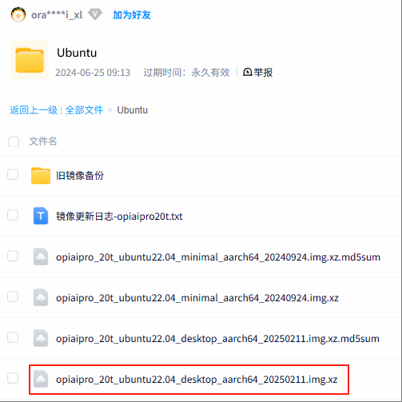

下载完毕后，解压该**压缩包**获得如图所示的Ubuntu镜像文件

### 第三步：使用balenaEtcher烧录orange pi的ubuntu镜像到SD卡中

选择要**烧录的文件**  
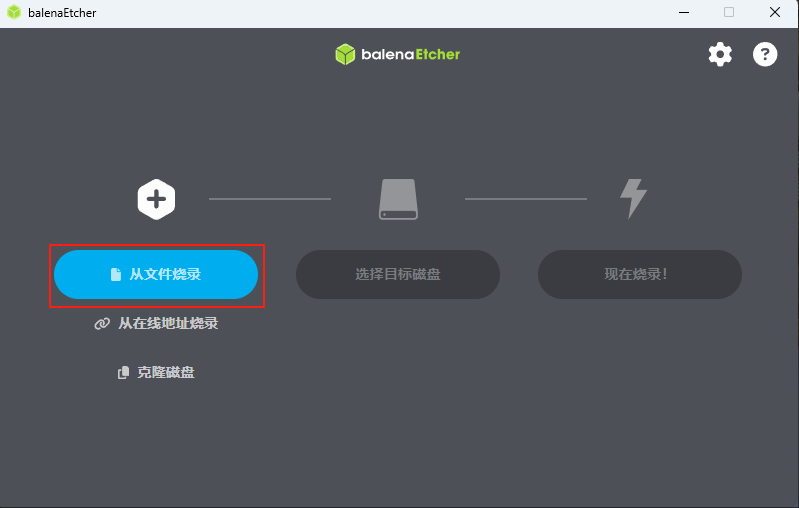

选择要烧录的**磁盘**  
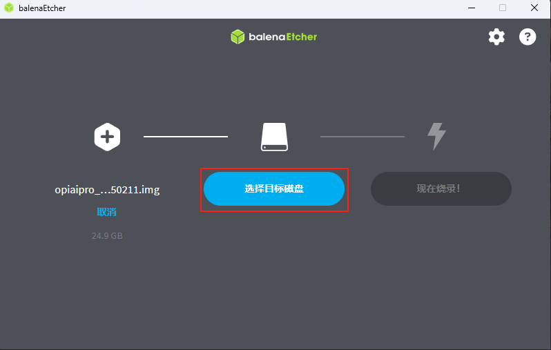

点击**现在烧录**按钮  
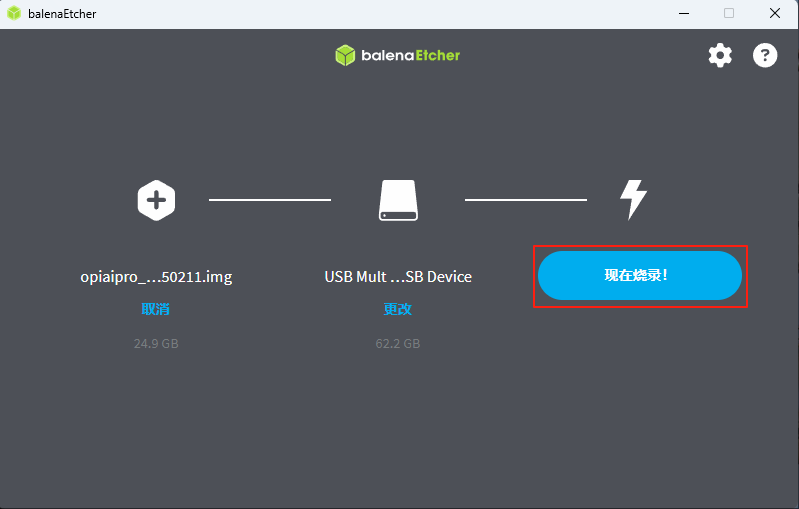

等待烧录完成  
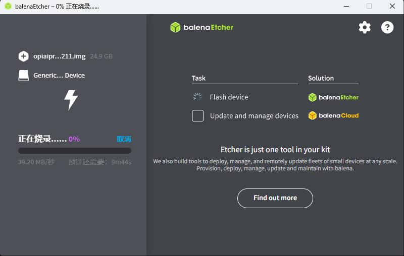

烧录完成后，将SD卡插入**Orange Pi AIpro(20T)开发板**上

### 第四步：进入系统

1. 为 `Orange Pi AIpro(20T)` 插上键盘、鼠标和显示屏。
2. 按开机键
3. 输入用户密码 **Mind@123** 并登录
4. 点击屏幕右上角的WIFI图标并连接可用的网络。
5. 打开终端

## 创建虚拟环境

我们的Ubuntu系统已预安装[Conda](https://www.anaconda.com/docs/getting-started/miniconda/main)，执行如下命令创建一个新环境并安装`python3.11`与`ffmpeg`。

    conda create -y -n lerobot -c conda-forge python=3.11 ffmpeg

执行下列命令激活该环境：

    conda activate lerobot

安装Lerobot。

    pip install -e "lerobot[feetech]"

安装CANN的依赖

    pip install -r /requirements.txt

前往[昇腾资源下载中心](https://www.hiascend.com/developer/download/community/result?module=cann&cann=8.1.RC1.beta1)，下载下图所示的软件包。

下载完成后，把安装包拷贝到当前目录，执行以下命令：

1. 给予toolkit安装包执行权限。  

        chmod +x ./Ascend-cann-toolkit_8.1.RC1_linux-aarch64.run
2. 安装toolkit。  

        ./Ascend-cann-toolkit_8.1.RC1_linux-aarch64.run --install

    安装完成后，如下所示：
    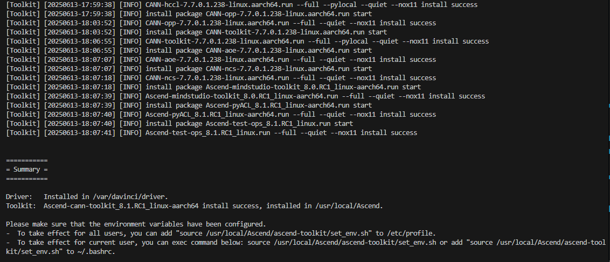

3. 给予Kernels安装包执行权限。  

        chmod +x Ascend-cann-kernels-310b_8.1.RC1_linux-aarch64.run
4. 安装Kernels。  

        ./Ascend-cann-kernels-310b_8.1.RC1_linux-aarch64.run --install

    安装完成后，如下所示：
    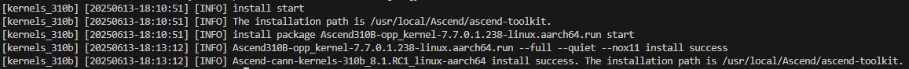

更多安装细节请参考[官方文档](https://www.hiascend.com/document/detail/zh/CANNCommunityEdition/81RC1beta1/softwareinst/instg/instg_0008.html?Mode=PmIns&InstallType=local&OS=Ubuntu&Software=cannToolKit)。

执行以下命令安装torch_npu。

    pip install torch-npu==2.5.1

更多`Ascend Extension for PyTorch`细节请参考[官方仓库](https://gitee.com/ascend/pytorch)。

至此，环境搭建完成。  
后续操作请参考[Lerobot官方](https://github.com/huggingface/lerobot)教程。

## 扩展知识1: 如何解决依赖冲突

根据[lerobot官网](https://github.com/huggingface/lerobot "lerobot")所提供的信息可知，Lerobot兼容的Python版本如红色方框内所示

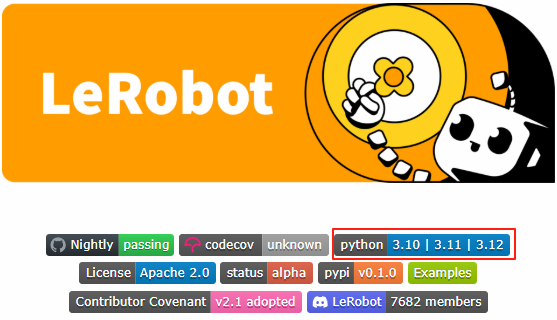

当前我们烧录的镜像中Python的版本如下图所示

由此可知，我们需要重新安装Python，使其与Lerobot兼容

因为CANN又依赖Python的版本，如下图所示

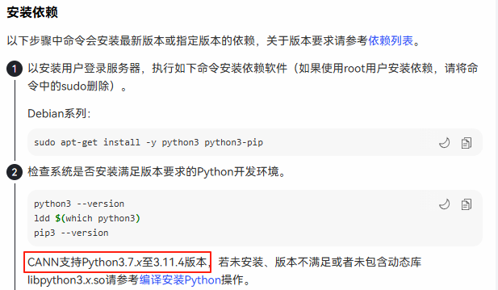

所以[CANN](https://www.hiascend.com/software/cann)也要重新安装

又因为[Ascend Extension for PyTorch](https://www.hiascend.com/software/ai-frameworks/pytorch)也依赖于CANN版本，所以它也需要重装。  
顾名思义，它依赖于PyTorch，如下图所示：

好，让我们言归正传，确认一下Lerobot需要的依赖。如图所示：

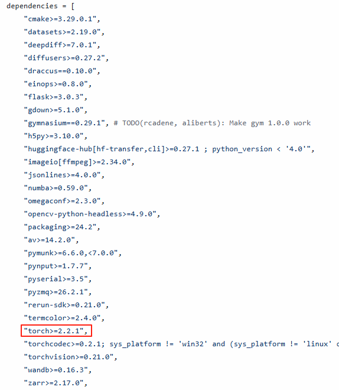

由上图可知，PyTorch版本需要>=2.2.1。

**综上所述，我们当前的环境依赖如下：**

- Lerobot
- PyTorch=2.5.1
- Python=3.11
- torch_npu=7.0.0
- CANN=8.1.RC1.beta1

## 扩展知识2：如何使用补丁

进入lerobot目录。

    cd lerobot

检出到特定的历史时刻。（我们是基于这个历史时刻进行开发的）

    git checkout a445d9c9da6bea99a8972daa4fe1fdd053d711d2 

应用git补丁。

    git apply ../lerobot_on_ascend.patch